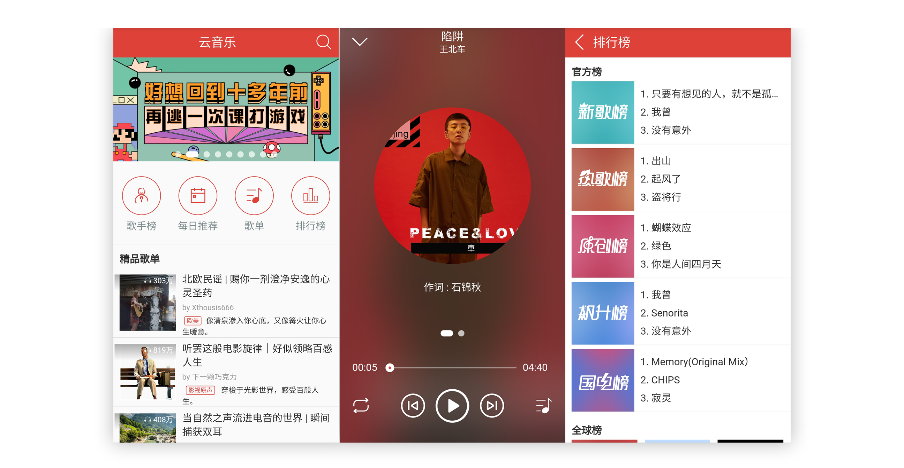
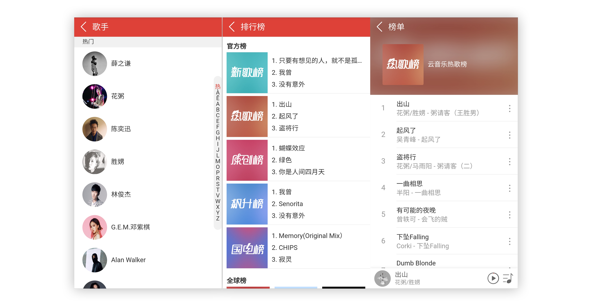

### 云音乐

用 Vue + Vue-router + Vuex + Axios 实现的网易云音乐播放器，功能包括歌单，歌手列表，歌曲榜单，搜索页，播放页。数据来源网易云音乐，使用 [网易云音乐API](https://binaryify.github.io/NeteaseCloudMusicApi/#/) 提供的接口。在线访问[http://www.zqblog.top:8089](http://www.zqblog.top:8089)

